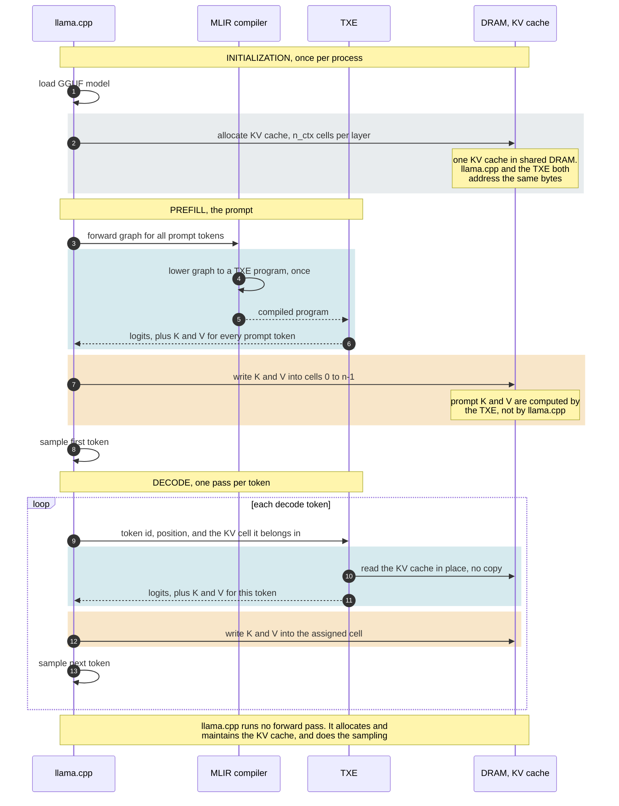
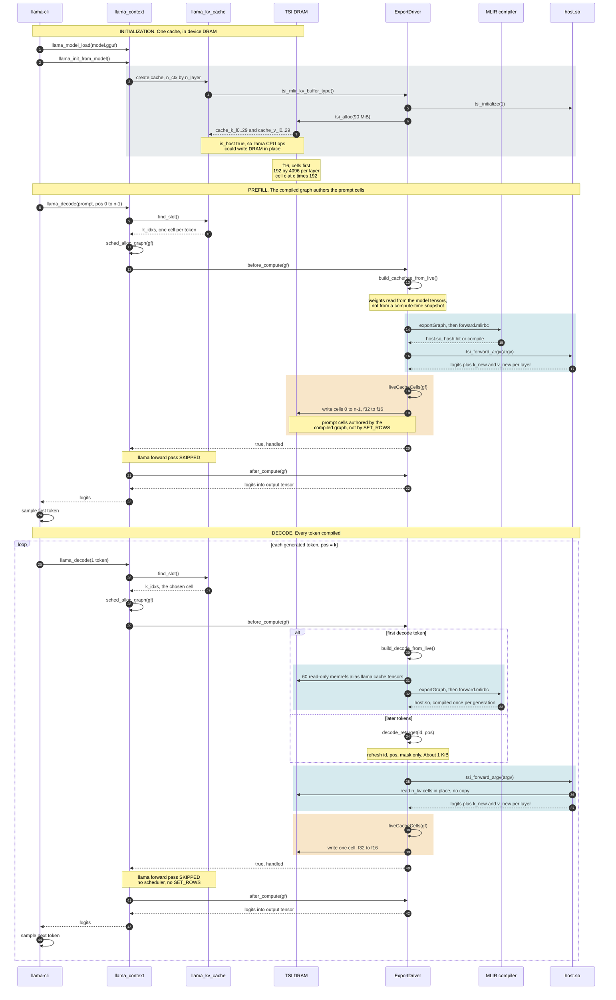

# Whole-graph TinyLlama on Tsavorite — build & run

Compile the **entire** ggml forward pass as one MLIR `func @forward` with the TSI mlir-compiler, run
it on tsisim/FPGA, and verify the next token against llama.cpp's own per-op output.

There are **no wrapper scripts and no manual steps**. The driver is compiled into `libllama`, so one
`llama-cli` command exports, compiles and runs:

```sh
RT=~/repo/mlir-compiler/build/_deps/runtime-build/lib

USER_DRAM_SIZE=16348 DYLD_LIBRARY_PATH=$RT TSI_MLIR_EXPORT=1 \
  llama-cli -m smollm2-135m-f32.gguf -p "hello world" -n 3 -no-cnv
```

That intercepts the forward graph, rebuilds it as one MLIR `func @forward`, compiles it through the
TSI compiler, runs it, and hands the logits back to llama, which samples from them and continues.

| env var | meaning |
|---|---|
| `TSI_MLIR_EXPORT` | `1` turns the driver on. Unset: every hook is a no-op |
| `TSI_MLIR_VERIFY` | `1` also diffs the compiled logits against llama's own |
| `TSI_MLIR_CPU_REF` | `1` also computes the reconstruction on CPU, for a 3-way split |
| `TSI_MLIR_DIR` | artifact + cache directory (default `./tsi-mlir`) |
| `TSI_MLIR_SKIP` | graphs to skip before acting (default `1`, llama's warmup graph) |
| `TSI_MLIR_PYTHON` | venv python with the tsavorite package |
| `TSI_MLIR_SCRIPT` | `compile_graph_fpga.py`, if not next to this source tree |
| `TSI_MLIR_DUMP_GRAPH` | `1` writes each intercepted graph's nodes to `<dir>/graph-<phase>.txt` |
| `TSI_MLIR_WEIGHT_ARGS` | `1` passes weights as arguments instead of baking them in as constants (see below) |
| `TSI_MLIR_CACHE_SUM` | `1` fingerprints the device KV cache and the logits after every decode step |

**Do not read a rising per-token decode error as a regression.** Past the first few tokens the *reference*
moves, not the compiled result: llama's CPU backend reduces in multi-threaded order, and its own KV cache
accumulates that variation, so llama's logits differ run to run for identical inputs. Measured on
SmolLM2-135M, the same command with a fixed `--seed` gives `rel_sq_err` of `3e-07` on some runs and `1e-02`
on others, while the compiled side is bit-identical throughout. `TSI_MLIR_CACHE_SUM=1` is how to tell the
two apart: it prints a fingerprint of the cache and the logits per step, and those are stable across runs
even when the diff against llama is not. Compare fingerprints run to run to check the compiled path;
compare against llama only for the first token, or on argmax agreement.
| `TSI_MLIR_CTX_MB` | override the reconstruction context size (default: sized from weights seen) |
| `TSI_DUMP_GGML_IR` | also dump the ggml dialect before lowering to linalg |
| `USER_DRAM_SIZE` | simulated device DRAM budget; a 1.1B f32 model needs `16348` |
| `TSI_RT_LIB_DIR` | where `libTsavRTShimCAPI` lives, for linking `host.o` -> `host.so` |

**Comparison is layered**, because each level costs more than the last. `TSI_MLIR_EXPORT=1` alone runs
the compiled forward and uses its result, comparing against nothing: the point is to run the model
through the MLIR path, not to check it. `TSI_MLIR_VERIFY=1` adds a diff against llama. Expect
`~1.1e-07`, essentially all of it unfused-attention vs llama's `FLASH_ATTN_EXT` rather than anything
the compiler did; compiled-vs-reconstruction measures `2.25e-12`. `TSI_MLIR_CPU_REF=1` adds a full
extra CPU forward pass to split a reconstruction bug from a compilation bug, which the 2-way diff
rarely fails to locate on its own.

**Compiled artifacts are cached** under `$TSI_MLIR_DIR/<phase>-<hash of the module>/`. A whole-model
compile takes minutes, so a rerun with the same model and prompt length reuses the binary and skips it
entirely. Different IR hashes to a different directory, so a stale hit is not possible.

Note that the graph llama runs first is its **warmup** graph (BOS+EOS), not your prompt, which is why
`TSI_MLIR_SKIP` defaults to 1.

The prefill reconstruction is **from-scratch only**, and enforces it: it rebuilds positions as
`0..n-1` and attends over the current tokens with no cache, so it checks the live graph's real
positions and refuses anything else rather than emitting valid-looking MLIR for a different function.

See [VERIFYING.md](VERIFYING.md) for how to check the compiled path against native llama.cpp: the three
runs, what each one actually proves, and why the per-token decode error is not the thing to assert on.

## Architecture

Two views of one `llama-cli` run with `TSI_MLIR_EXPORT=1`. Shaded bands mark where the work happens:
**blue-grey** is the MLIR compiler and the TXE, **amber** is the KV cache being filled from the
compiled graph's results, **grey** is llama.cpp allocating that cache in shared DRAM.

### Roles and phases

llama.cpp owns the KV cache and sampling but runs no forward pass. The MLIR compiler lowers the model's
graph to a TXE program once; the TXE executes it; the KV cache sits in shared DRAM that both sides
address directly. On a host build the TXE lifeline is the FFM functional model.



### The same run, with call sites

Seven lifelines against the real code. `before_compute` returning true is what makes llama skip its own
forward pass, and the cache write lands at the cell `k_idxs` names rather than at `pos`.



---

## Build (x86 build box)

```
SDK_VERSION=0.4.17 source tsi-pkg-build.sh triton all build-fpga package
# produces tsi-ggml-0.4.17.tz
```

## Deploy to tsisim

```
scp tsi-ggml-0.4.17.tz <tsisim>:/root/
# on tsisim:
tar -zxvf tsi-ggml-0.4.17.tz            # e.g. -> /root/tsi-ggml
```

tsisim ships with a bundled `tsi-ggml` symlink; repoint it at the package you just built:

```
cd /usr/bin/tsi/bin
ls -lrt                                 # tsi-ggml -> /opt/... (the bundled build)
rm -rf tsi-ggml
ln -s /root/tsi-ggml tsi-ggml           # source = any untarred path
```

## Run (on tsisim)

```
cd /root/tsi-ggml
# 1. activate the mlir-compiler venv first (compiler wheels used by the compile step) -
#    follow the standard mlir-compiler venv activation.
# 2. make the runtime libs visible:
export LD_LIBRARY_PATH=$LD_LIBRARY_PATH:/usr/bin/tsi/bin/tsi-ggml
# 3. copy the TXE blobs into the runtime's load path:
./ggml.sh
# 4. run - the same single command as the host flow above, with
#    TXE_FPGA_CONFIG=txe_arm.json for the fpga target.
```

Expected tail:

```
[tsi-mlir] compiled vs llama:  rel_sq_err=1.1e-07  argmax <N> vs <N> -> MATCH
```

### Notes

- **Activate the compiler venv before running**, or point `TSI_MLIR_PYTHON` at it — the driver shells
  out to `compile_graph_fpga.py`, which imports the mlir-compiler wheel packages.
- **`./ggml.sh` must run once after deploy** so the runtime finds the TXE blobs.
- The SDK/Xtensa paths are read from the environment (`MLIR_SDK_VERSION`, `XT_TOOLS_DIR`,
  `XT_SYSTEM_DIR`, `TSI_RT_LIB_DIR`, `TXE_FPGA_CONFIG`); `txe_arm.json` is the tsisim/arm config.
- Host-only CPU checks (no device): build `ref_check` + `recon_cpu_check` and compare argmax
  (`ref_check <gguf> "<prompt>"` prints the ids + reference token; `recon_cpu_check <gguf> <ids…>`
  prints the reconstruction's argmax). These cover `build_layer` in `ModelLayer.h`, which is what the
  capture path reconstructs with.

---

## KV-cache decode

Both phases run compiled, and **every decode token** goes through the compiled graph, not just the
first. There is exactly **one** KV cache: llama allocates it, llama maintains it, and the compiled
graph reads it in place.

| concern | owner |
|---|---|
| cache storage | llama, allocated from TSI shared DRAM (`tsi_mlir_kv_buffer_type`, swapped in at `llama-kv-cache.cpp`) |
| slot allocation, context shift, defrag, `seq_rm` | llama, unchanged — it mutates the same bytes we read |
| the forward pass | the compiled MLIR graph |
| the K/V *values*, prompt and tokens alike | the compiled MLIR graph, written by the driver at llama's cell indices |

Both phases produce their own K/V. Prefill returns logits plus per-layer `k_new`/`v_new` for the whole
prompt and the driver writes cells `0..n_tokens-1`; decode does the same for one cell per token. So the
cache has a single author — the compiled graph — rather than llama's f16 FLASH_ATTN pass owning the
prompt and the reconstruction owning everything after it. Prefill reads nothing from the cache (it
starts at position 0, so there is no prior context); it only writes.

The decode graph takes one **read-only** memref per layer per kind, each aliasing llama's own
`cache_k_l<il>`/`cache_v_l<il>`, and returns logits plus per-layer `k_new`/`v_new`. So no cache is ever
copied in either direction — a token moves only id, pos, mask and ~23 KiB of results. The memref spans
llama's full `n_ctx` while a step reads the live `n_kv` window as a strided prefix (256 of 4096 on
SmolLM2). One compile serves a whole generation: `pos` and `mask` are runtime arguments, so the same
binary works at every position.

Because the graph produces both the logits and the cache update, **llama's own forward pass is skipped
entirely** for decode — `before_compute` returns true and `graph_compute` runs neither the scheduler nor
an allocation (`process_ubatch` has already allocated, so every tensor has its buffer). **Both phases
are handled this way**, so with `TSI_MLIR_EXPORT=1` llama computes no forward pass at all: it allocates
and maintains the cache, and the compiled graph produces every value in it.

That required prefill to move into `before_compute` — its result has to exist before the skip decision
is made — and the weights to come from the model's own persistent tensors rather than the eval
callback's snapshot, which only exists if llama computes. If a weight has no readable data before
compute the reconstruction throws, the hook returns false, and llama computes exactly as it used to.

The one exception is `TSI_MLIR_VERIFY`, where llama computes throughout and the driver writes no cache
cells, since llama cannot be an independent reference while reading values we produced.

When llama's pass is skipped its `SET_ROWS` goes with it, so the driver writes the new K/V itself — at
the cell **llama's allocator chose**, read from the `k_idxs` graph input, not at `pos`. The two agree
only in a fresh append-only sequence; after a removal or a defrag they diverge, and using `pos` would
corrupt llama's cache. The f32 results are narrowed to f16 on the way in, the same rounding llama
applies.

A decode session is rebuilt from the live graph whenever llama's window grows or the position stops
advancing by one — a conversation reset, a context shift or a cleared slot all land there, and
rebuilding re-reads the geometry rather than computing against a previous sequence's keys.

Still refused rather than approximated: a quantized KV cache (a q8_0 block has no memref element type),
a transposed V cache (`-fa off`), `n_stream > 1`, and multi-token decode batches.

The decode graph is a separate, fixed-length graph — one MLIR func returning logits plus per-layer
`k_new`/`v_new`, reused for every token with the cache held on the host. Two tools share it, both
building it with `build_decode` from `DecodeModel.h`, so the checked graph and the compiled graph
cannot drift apart: `decode_cpu_check` emits it and checks it on CPU, `decode_run` executes the
compiled result.

```sh
cmake --build build --target decode_cpu_check decode_run
ids=$(./build/bin/ref_check smollm2-135m-f32.gguf "hello world" | sed -n 's/^ids: //p')

# CPU check + emit: decode step k (cache = tokens 0..k-1) must equal prefill(0..k) at the last position
./build/bin/decode_cpu_check smollm2-135m-f32.gguf $ids --L 6 --emit decode.mlir

# compile, exactly as for prefill
USER_DRAM_SIZE=16348 TSI_RT_LIB_DIR=$RT \
  ~/repo/mlir-compiler/venv/bin/python compile_graph_fpga.py decode.mlir out_decode

# run the compiled decode graph, diffing every step against a CPU prefill of the same prefix
USER_DRAM_SIZE=16348 DYLD_LIBRARY_PATH=$RT ./build/bin/decode_run smollm2-135m-f32.gguf \
    --lib out_decode/host/host.so --prompt "hello world" --L 6 --gen 2 --verify
```

`decode_cpu_check <gguf> <id0> [id1 …]` takes `--L` (cache cap, ≥ number of ids), `--emit <file>` and
`--dump-io <dir>` (every input/output of step 0 plus a `manifest.json`). `decode_run` takes
`--lib`/`--emit`, `--prompt` or raw ids, `--L`, `--gen` and `--verify`.

Verified on SmolLM2-135M f32: 336 args, 61 outputs, `_mlir_ciface_forward` 397 pointer args, and
`compiled-decode vs prefill: 3/3 MATCH` with rel_sq_err ≤ 1.2e-12.

---

## Notes on the host runtime

`tsi_initialize()` must be called before the first `tsi_alloc()`, and `tsi_finalize()` before exit.
On a TSI build the ggml-tsavorite backend does both during `llama_backend_init` / `ggml_backend_free`;
a plain host/FFM build has no such backend, so `src/driver/Runtime.h` and `decode_run.cpp` do it
themselves. Skipping the init segfaults on the first allocation; skipping the finalize makes the
process **hang at exit**, idling long after it has printed its results — which looks like slow compute
but is not.

Host-only check (no FPGA): `decode_cpu_check <gguf> <ids…> --L <n>` runs the same fixed-L decode
against a CPU prefill and prints the per-step MATCH.

---

## How the exporter works: ggml dialect then linalg

The exporter is a two-stage MLIR pipeline built with the MLIR C++ API. There is no IR text
generation anywhere; MLIR builds and verifies the module, and only the final print produces text.

```
ggml_cgraph ──[import]──► `ggml` dialect ──[convert-ggml-to-linalg]──► linalg ──► forward.mlir
```

| Stage | Path | Role |
|---|---|---|
| dialect | `src/dialect/GgmlOps.td` | 13 ops mirroring ggml, plus ODS verifiers |
| import | `src/import/Importer.cpp` | 1:1, one dialect op per graph node, `op_params` as attributes |
| convert | `src/convert/Patterns*.cpp` | one file per op family, lowering to linalg |
| entry | `src/export/Exporter.cpp` | import, verify, lower, verify, print |

Dump the intermediate to see what was read from the graph, separately from how it was lowered:

```
TSI_DUMP_GGML_IR=1 ./build/bin/test-mlir-export-cases --emit silu /tmp/x
```
```mlir
%0 = ggml.silu %arg0 : tensor<128xf32> -> tensor<128xf32>
```

**Where constraints live.** ggml's *own* invariants are dialect verifiers: `mul_mat` reduction-dim
agreement and GQA divisibility, rope position count, reshape element-count preservation, concat dim
bounds, `get_rows` row count. Our *lowering's* limits are `notifyMatchFailure` in the pattern that
cannot proceed: ALiBi softmax, permute outside rank 2-3, an unhandled reshape pair, NEOX rope,
partial rotation, YaRN scaling. So the dialect accepts anything ggml can express, and only the
lowering admits what it cannot handle. Adding an op means one `.td` entry plus one pattern.

**Shape convention.** Dialect ops carry MLIR-ordered tensor types (ggml `ne` reversed), reversed
once in the importer. Attributes that *name* dims (`permute` axes, `concat` dim) stay in ggml dim
space, verbatim from `op_params`, because translating them is part of lowering.

**One entry point.** `exportGraph(gf, ExportOptions)` handles single and multiple outputs; an empty
`outputs` means the graph's last node. It returns a **complete module**, so callers must not wrap it
in `module { ... }`.

### Building it

Needs MLIR from the mlir-compiler checkout, never a system or Homebrew LLVM (it would be a different
version than the compiler consuming the output). `MLIR_DIR` is derived from `MLIR_COMPILER_DIR`
automatically; if MLIR is absent the library is skipped with a message and a plain host build still
succeeds. Two non-obvious build rules, both learned the hard way:

- The enclosing CMake project must enable **C**. `find_package(MLIR)` reaches `FindLibEdit`, which
  runs a C `check_include_file` and errors out in a CXX-only project.
- Never `include(HandleLLVMOptions)`. It adds `-fno-exceptions`, and the exporter throws.

`mlir_tablegen` also takes its `-I` flags from *directory-scope* `include_directories`, not target
properties. And `find_package(MLIR ...)` is called with `NO_DEFAULT_PATH`: without it, an
unresolvable `MLIR_DIR` is ignored and CMake falls back to its default search paths, which on a
machine with Homebrew LLVM silently builds against MLIR 17.

The fpga/aarch64 target **cannot** link this, since MLIR is host-only here. That is accepted; the
tsavorite CMakeLists emits a warning naming the reason rather than leaving a bare linker error.

## Export unit test suite (no FPGA, no model)

Verifies the exporter itself end to end on small graphs: ggml graph → linalg MLIR → TSI compiler →
JIT execute → compare against ggml's own CPU result. Runs on a plain host build (macOS included) in
under 10 s; needs only a built [mlir-compiler](https://github.com/tsisw/mlir-compiler) checkout, no
model file and no hardware.

```
ctest --test-dir build -L mlir-export --output-on-failure
```

Two tests, deliberately separate so a failure names its own cause:

| Test | What it proves | Needs | Time |
|---|---|---|---|
| `mlir-export-suite` | the compiled graph matches ggml numerically | TSI compiler venv | ~12 s |
| `mlir-export-lit` | each ggml op lowers to the expected linalg | `llvm-lit`, `FileCheck` | ~0.2 s |

`MLIR_COMPILER_DIR` defaults to `~/repo/mlir-compiler`; point it elsewhere with
`cmake -B build -DMLIR_COMPILER_DIR=<path>`. If its `venv/bin/python` is missing the suite reports
**skipped** and configure still succeeds — a host build never starts requiring the compiler repo.

23 cases, covering every one of the exporter's op lowerings: `add`, `mul`, `scale`, `silu`,
`rms_norm`, `soft_max`, `matmul`, `matmul_add`, `matmul_vec`, `matmul_3d`, `matmul_gqa`, `permute`,
`permute_size1`, `reshape_split`, `reshape_merge`, `concat`, `get_rows`, `get_rows_1tok`, `rope_2d`,
`rope_3d`, plus `matmul_const_w` / `get_rows_const_w` (baked-constant weights) and `add_negative`.

The seven pure data-movement cases are held to **bit-exact** equality (`rtol=atol=0`); they measure
0.0 error, so that is a real constraint rather than an accident. rope measures 1.5e-07/1.8e-07 max
abs and the matmul variants 2.4e-07 to 9.5e-07. Tolerances are measured, never guessed.

### Half precision: f16 and bf16

The dialect admits `f16` and `bf16` so imported IR stays a faithful record of the graph, but no
lowering pattern ever sees a half-precision operand. `promote-ggml-to-f32` runs between import and
lowering, widening half inputs, rewriting the op at f32, and narrowing results back.

**f32 accumulation is the reason, and it is not an optimization.** An f16 sum over 2048 elements loses
most of its significance, so every reduction in the model — matmul, `rms_norm`, `soft_max` — has to
accumulate in f32 whatever the weights are stored as. Promoting once gets that everywhere; the
alternative, teaching five pattern files to widen their own accumulators, is the same rule written five
times and five chances to miss one.

It also covers the mixed case llama actually produces: an f16 weight against an f32 activation.
Extending each float operand independently makes that fall out with no special case, and nothing is
narrowed on the way out because the result was already f32.

Casts are emitted as `linalg.generic` wrapping `arith.extf`/`truncf`, not as tensor-level `arith` ops,
because that is the form the rest of the lowering produces and is guaranteed to bufferize.

Covered by `tests/lit/promote-f32.mlir` (f16, bf16, the mixed matmul, and that an all-f32 graph comes
out untouched) and end to end by the `matmul_f16_w` case, which is llama's f16-model shape and is
checked against ggml's own f16 result.

### Weights as constants

`ExportOptions::runtime_args` is the whole rule: those leafs become `%arg`s, and every other leaf the
exporter discovers is baked into the IR as a constant. There is no flag and no name heuristic - a
leaf is either a per-step input the caller declares, or it is a constant. Baking lets the compiler
see the weight values and fold, pre-tile and place them, and the compiled `host.so` then no longer
needs a matching weight buffer at run time.

Two things make that affordable:

- **`dense_resource`, not inline `dense<>`.** The data lives in a named blob outside the op. A
  contiguous, 4-byte-aligned tensor is referenced in place with no copy, so exporting does not need a
  second copy of the model in memory. A strided view is gathered through `nb[]` into a temporary.
- **`Format::Bytecode`.** Text prints a blob as hex, exactly 2 characters per byte. Bytecode keeps it
  raw, so the module is the weight bytes plus a few KB. Measured on the `test-bytecode-export`
  fixture: text 17223 bytes, bytecode 8889, for an 8192-byte weight.

The two `*_const_w` cases in the end-to-end suite check the values survive the round trip;
`bytecode-export-compile` checks the compiler accepts a bytecode module with a blob in it.

Measured end to end on SmolLM2-135M f32, a whole model with every weight baked in:

| stage | result |
|---|---|
| export | 275 leafs -> **3 args + 272 constants**, 513.24 MiB bytecode, 1.93 s, 2.64 GiB peak RSS |
| compile | `host.so` OK, `_mlir_ciface_forward takes 4 pointer args`, **140 s, 5.50 GiB peak RSS** |

So a full model does compile with its weights as constants. Scaling is sublinear in memory: 8x the
payload of the earlier 64 MiB probe cost 3.9x the time and 1.6x the RSS.

The binding constraint is **disk, not memory**. For a 513 MiB module the pipeline writes 3.46 GiB of
`host.ll` and 1.08 GiB of `host.llvm.mlir`, plus a 542 MB `host.so` - roughly 9x the weight bytes,
because LLVM's textual IR spells out every constant. TinyLlama-1.1B f32 would need tens of GiB of
scratch on that ratio, which is the case for f16 weights rather than any memory limit.

### Per-op lowering tests (lit + FileCheck)

`tests/lit/` checks what a single ggml op lowers to, which the end-to-end suite cannot say without
running a whole graph through the TSI compiler. No Python, no compiler, milliseconds.

```
./build/bin/tsi-ggml-opt --convert-ggml-to-linalg tests/lit/matmul.mlir
```

Run the suite by hand:

```
TSI_LIT_TOOLS_DIR=$PWD/build/bin \
TSI_LIT_LLVM_TOOLS_DIR=~/repo/mlir-compiler/build/_deps/llvm-build/bin \
  ~/repo/mlir-compiler/build/_deps/llvm-build/bin/llvm-lit -sv examples/mlir-export/tests/lit
```

`errors.mlir` is the interesting one. It pins down *which layer* rejects what: a violated ggml
invariant must fail in the dialect verifier, and a limit of our lowering must fail as `failed to
legalize operation 'ggml.<op>'`. If those ever swap places, the separation between the two has broken.

### Two stages, each runnable alone

`test-mlir-export-cases` (C++, links ggml only) writes a self-contained case directory —
`forward.mlir`, `input_<i>.bin`, `expected_0.bin`, `case.json`. The pytest runner consumes it and
never touches ggml. So when a case misbehaves you can bisect the stages:

```
./build/bin/test-mlir-export-cases --list
./build/bin/test-mlir-export-cases --emit matmul /tmp/c          # stage 1: export + CPU reference
~/repo/mlir-compiler/venv/bin/python -m pytest \
    examples/mlir-export/tests/test_mlir_export.py \
    --cases-root /tmp --target ffm -v -k matmul             # stage 2: compile + run + compare
```

Compilation runs with `log_mlir=True`, so every lowering stage (`linalg.mlir`, `tile.mlir`,
`bufferize.mlir`, `vector.mlir`, `txe.mlir`, `host.mlir`) is left in the output dir for debugging.

### Adding a case

One `build_fn` plus one `CASES` entry in `tests/test-mlir-export-cases.cpp`. No Python change — the case
directory is the interface. Inputs are filled from a fixed `mt19937` seed and the reference is
computed with `ggml_graph_compute_with_ctx(ctx, gf, 1)`, so cases are bit-for-bit reproducible.

### Targets

`--target ffm` (default) is the host-native functional model. `--target ten` targets the TXE
simulator and **only works on an SDK box**: TXE blob compilation shells out to Cadence `xt-clang`
under `/proj/vendors/cadence/…`, so everywhere else all cases skip with that reason. It is wired but
unexercised off-box — do not read a green `ffm` run as evidence about `ten`.

### `add_negative`

Emits the `add` graph with element 0 of `expected_0.bin` offset by 1000.0, and asserts the
comparison **fails**. It exists because a harness bug that compared nothing would leave every other
case green and indistinguishable from a working suite. If `add_negative` ever fails, the comparison
logic is broken and the rest of the suite's green means nothing.
